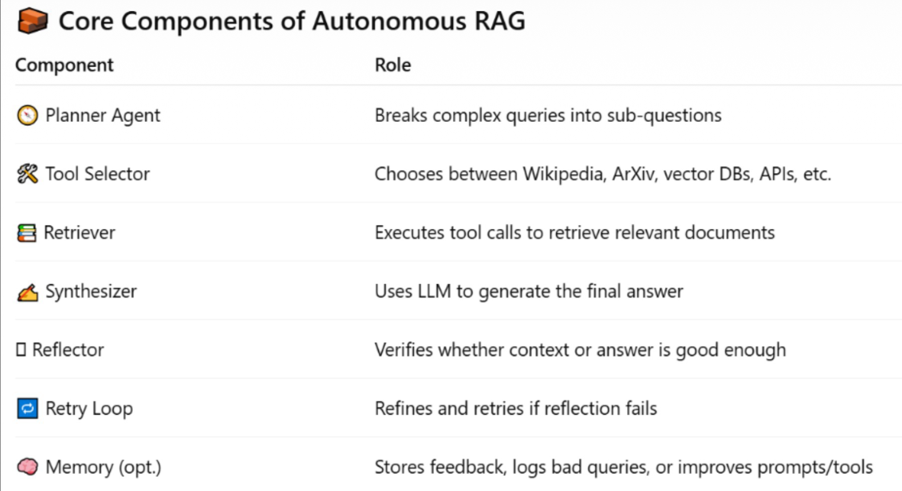

Beginner friendly repo that helps learn RAG from scratch

RETRIEVAL AUGMENTED GENERATION (RAG)
using LangChain and LangGraph

    Different types of Projects included are made with open source LLMs used for embedding and for reasoning
    To run this repo : 1. Create a .env file and add GROQ_API_KEY(important),TAVILY_API_KEY(secondary)

1. For installation of uv :

For MacOs or Linux 

    curl -LsSf https://astral.sh/uv/install.sh | sh

For Windows 

    powershell -ExecutionPolicy ByPass -c "irm https://astral.sh/uv/install.ps1 | iex"

In terminal:
uv init
uv venv
uv add -r requirements.txt

In Data Ingestion part :
LangChain wants us to convert the given data in particular format :
{
    page_content:"content",
    metadata(dict):""
}

TextLoader and DirectoryLoader 

CharacterTextSplitter - normal,based on given chunk size , no intelligence
RecursiveCharacterTextSplitter - hierarchy wise splitting ["\n\n","\n"] => first \n\n then \n ,intelligent splitting
TokenTextSplitter - based on tokens, it splits

Loading a PDF file
pypdf - simple but slow
pymupdf - speed

Pdf has some issues 
    - may contain images
    - formatting issues

    Creating smart chunks after cleaning those issues and  creating better metadata for chunks 

Parsing a docx
    - Docx2txtLoader => Simple,plain,dumb,fast
    - UnstructuredWordDocumentLoader => Parses the document into semantic elements
        Preserves structure:
        Titles
        Headings
        Paragraphs
        ists
        Tables
        Page breaks
        Adds metadata

Parsing a CSV file and Excel file is quite similar
    - CSVLoader 
    - UnstructuredCSVLoader => typically we create custom meta-data and page_content taken from csv columns

    EXCEL loading is done with pandas and also unstructured but unstructured doesn't seem to work so partition_xlsx did the job

Json parsing is can be done through langchain module or using custom way to get better readable documents

SQL databases can be loaded through 
    
    from langchain_community.utilities import SQLDatabase

or also creating a custom loader which makes it a readable document by LLM

Cosine Similarity :

    Cosine Similarity =     A.B / |A||B|

There is a chance to work with OPENAI embedding models but that is pricey
So i considered to go with huggingface models which give same results 90 percent of time

Huggingface models as vector embeddings and google models as LLM work just fine

Vector Store => light weight , mini - version of vector database
Vector Database => full fledged and has many features 

FIASS works great with GPU availability and ChromaDB is production grade

Groq models as LLM works great for production grade because of better rate limits

    Conversational memory is the key for context length

Simple RAG
Streaming RAG - where StrOutputParser is not required
Conversational Memory RAG ***

There is another vectorstore known as InMemoryVectorStore 
    - stores in as dictionary , retrieves using cosine similarity

Datastax Astradb vectorstore connects with Vector database 

This datastax understanding will be done through google colab because of large set of dependancies

There is also Pinecone Vector Database that can be used for free

Chunks after splitting should be contextually rich,self-contained and logically seperated

Similar chunks are merged after splitting so that all the related stuff will be in one place

Initializing an embedding model got easier 

    from sentence_transformers import SentenceTransformer
    model=SentenceTransformer('all-MiniLM-L6-v2')

That specific model is used because no api key required and opensource for embedding

Semantic Chunking - if similarity between chunks are above threshold append one to another to give meaningful context

------------------------------------------------------------------------------------------------------------------

Combining dense and Sparse Matrices to get better at Retrieval Augumented Generation

Sparse => TF-IDF
Dense  => ( Embeddings + Cosine Similarity )

    Score(hybrid) = alpha * Score(dense) + ( 1 - alpha ) * Score(sparse)

Better RAG model

Key Benefits of Hybrid Search

    1. Boosts Recall

        BM25 catches exact keyword matches

        Semantic search captures meaning even when wording differs

        Together, you reduce the chance of missing relevant documents

    2. Handles Synonyms & Rephrasing

        Semantic search can match queries like “create app” → “build LLM system”
        
        BM25 still catches exact terms like “LLM”, “app”

    3. Improves Retrieval Robustness

        Supports both:

        Users who search with precise keywords

        Users who use natural language questions

    4. Preserves Lexical Importance

        BM25 gives higher weight to rare or critical terms

        Essential for technical, legal, or medical domains
        (e.g., rare terms like “osteoporosis”)

    5. Bridges Document Diversity

        Works well across mixed data sources:

        Web pages

        PDFs

        Blogs

        Well-structured + loosely written text

        Hybrid retrieval adapts better than either method alone

    6. Easy to Tune with Weights

        You can control how much each method influences the final result:

            final_score = 0.7 * semantic_score + 0.3 * bm25_score

        This makes optimization simple and flexible.

    7. More Tolerant to Typos & Variants

        Semantic models handle:

        Misspellings

        Word variants

        BM25 alone may fail here, but hybrid search catches more cases.

Re-Ranking Technique => Hybrid Search Strategy Type

    Second Stage Filtering Process in retrieval systems
    - first use a fast retriever to fetch top-k documents
    - use more accurate but slower model to re-score and re-order those based on the relevancy of the query

Maximal Marginal Relevance

    It selects documents that are both 
    - Relevant to the query
    - Diverse from each other(the documents)
    
    * Prevents the retriever from returning the similar documents that repeat the same content

    MMR(doc) = lambda * Sim( doc , query ) - ( 1 - lambda ) * max(s belongs to S) Sim( doc , S)
    
    the MMR(doc) should be high which means it is diverse and also relevant 
    
    if not clear do with an example

When to use MMR :
    . In a RAG to avoid feeding the LLM with redundant documents 
    . ChatBots : FAQ , Search APP 
    . Retriever already returns many results 
    . MMR + Hybrid retriever => Deadly combo ( i think )

When not to use :
    . You are already re-ranking 
    . Documents are already diverse 
    . Extreme short context window
    . You may want top 1 relevant 
    . You need precision only

    Query Enhancement is using a LLM to broaden the query in a similar way to vector database chunks such that it becomes meaningful and easier to compare and retrieve results

    After all understood how LCEL is built and built my own for Query Enhancement

Query Decomposition :
    * LLM + prompt to decompose
    * Regular Expression ["\n\n/.,*()"]
    Query is broken down into subqueries that call the retriever many times => LLM calls many times => Answer by Synthesising or connecting the dots => Final Answer

HyDE : Hypothetical Document Embeddings 
    Before sending the query into the RAG pipeline it is sent to llm which then returns imaginary answer to the query which is then scored on similarity
    
Multimodal -> Text and Images Understanding
        Completed this via an opensource model 

Langchain Latest things :
    - Basic Agent Exploration
    - Tools for the Agent
    - Types of Messages => SystemMessage,AIMessage,HumanMessage,ToolMessage
    - Pydantic used for structuring the output in runtime. Ex: Movie details
    - Typedict same purpose as pydantic but without errors at runtime
    - Nested Structures in both
    - DataClasses

Middleware :
    - Summarization Middleware - messages,tokens,fractions
    - Human in the Loop - email sending example 
    - for many more visiting the docs of langchain for middleware is necessary

LangGraph 
    
    creating a basic graph

 ReAct Agent Architecture
    The intuition behind ReAct, a general agent architecture.

1. act - let the model call specific tools
2. observe - pass the tool output back to the model
3. reason - let the model reason about the tool output to decide what to do next (e.g., call another tool or just respond directly)

Then there comes agents with memory -> generally this is done through creating a specific thread for every user who is conversing
By using that config when invoking helps the llm to remember the context

Different Streaming Techniques 
    .stream() and .astream()
     There are two types of stream_modes : values and updates
     values - the whole conversation from start to latest
     updates - the latest only

     .astream() is used to get not only the states of the graph but also where the llm is called , every minute detail , every specific event such as on_chat_start,on_chat_end,on_chat_model_start,on_chat_model_stream,etc

Debugging all of this via Langsmith :
    Dependency:

        langgraph-cli[inmem]

    a langgraph.json file for configuration and the main file for accessing the agent through langsmith
    It helps very much

    After creating an agent and going into the directory that contains the agent file and langgraph.json file run

        langgraph dev
    
    or if safari browser 

        langgraph dev --tunnel

Agentic RAG
    
    Think → Retrieve → Observe → Reflect → Final Answer

In this LLM has the capability to call multiple tools for multiple vector databases and also for multiple purposes

There is a project in AgenticRAG subfolder where 
 
    The RAG pipeline  takes the query in goes to the vector database that it thinks is perfect for the query 
    If the retrieved documents from the database doesn't match that of the query - which is checked by another agent - then it reinitiates the process again and checks another relevant database for documents and reasoning

Autonomous RAG
    It is a type of RAG where an LLM(or agent) is capable of reasoning,planning,acting,reflecting and improving - on its own without the intervention of a "Human"

STAGE 0 — Goal Intake

Type: Pipeline Stage (Entry)

Input

User query

Optional system constraints

Responsibility

Capture the task intent

Normalize input into a goal representation

Output

Goal: a clean, explicit task statement

STAGE 1 — Query Planning & Decomposition

Type: Pipeline Stage (Control)

Input

Goal

Responsibility

Decide what needs to be done

Break the goal into structured sub-tasks or sub-queries

Determine execution strategy

Output

TaskPlan: ordered or parallelizable sub-queries

Notes

This stage decides what to solve, not how

STAGE 2 — Tool-Oriented Execution (Agentic RAG)

Type: Pipeline Stage (Execution)

Input

TaskPlan

Responsibility

Execute sub-queries using tools and knowledge sources

Perform retrieval, API calls, and external searches

Observe and collect evidence

Output

Observations: raw retrieved documents, tool outputs, logs

Included Policies

ReAct (Reason → Act → Observe)
Governs how tools are chosen and invoked

Iterative Retrieval
Refines search queries based on missing or weak evidence

Notes

This stage may loop internally

It does not judge correctness

STAGE 3 — Knowledge Consolidation (Answer Synthesis)

Type: Pipeline Stage (Construction)

Input

Observations

Responsibility

Combine evidence from multiple sources

Resolve overlaps and redundancies

Build a coherent internal explanation

Output

DraftAnswer: a synthesized, structured response

Notes

No validation or approval happens here

STAGE 4 — Self-Reflection (Evaluation)

Type: Pipeline Stage (Evaluation)

Input

DraftAnswer

Original Goal

Responsibility

Evaluate correctness and completeness

Identify missing, weak, or incorrect elements

Decide whether the agent should stop or continue

Output

ReflectionResult:

PASS → answer is sufficient

FAIL → feedback describing what must improve

Notes

This stage never retrieves or generates content

It only judges and provides feedback

STAGE 5 — Adaptive Loop (Autonomy Core)

Type: Control Logic (Not a content stage)

Input

ReflectionResult

Responsibility

Route the agent based on reflection outcome

Decide whether to:

re-enter execution (Stage 2)

re-synthesize (Stage 3)

or terminate

Output

Updated execution path

Notes

This loop enables self-improvement and autonomy

STAGE 6 — Finalization

Type: Pipeline Stage (Exit)

Input

Approved DraftAnswer

Responsibility

Format and present the final output

Terminate agent execution

Output

FinalAnswer

Cross-Cutting Concepts (Not Pipeline Stages)

These concepts operate inside multiple stages and should not be modeled as standalone steps.

Chain of Thought

Type: Reasoning Mode

Used In

Planning

Tool execution

Synthesis

Reflection

Role

Enables structured internal reasoning

Not exposed as a pipeline stage

Memory (Optional)

Type: System Capability

Used For

Storing feedback

Improving future planning and retrieval

Logging failures or successful strategies

        Iterative Retrieval : “I didn’t find enough info, let me search again.”
        Self Reflection : “I didn’t find enough info,why? What should I change?”

Worked on each individual aspect of autonomy of an agent - working on a single agent that does all these - integration ⨓

Corrective RAG : 
- An Advanced Type of RAG where self-reflection and self-grading is incorporated to imporove the accuracy and relevancy of generated response.

- Robust System, Improved Accuracy and Enhanced Relevance are some of the features.

- It helps in refining or replacing incorrect retrievals

- Why ? Traditional RAG Systems rely heavily on accuracy of retrieved docs. If the retrieved info is flawed or incomplete. The generated response can be inaccurate.

- In this only self-grading is done.

Adaptive RAG :
- A RAG System that dynamically adjusts its strategy for handling queries based on their complexities

- It simply classifies whether to dig deeper into understanding and retrieving the result for the query or just answer the query itself from its own knowledge

-      Capital of India - Simple - Answer itself : Delhi,
-      What is the relationship between AI slop and increase of RAM prices - Complex : Dig deeper for retrieval

Still not done include : Multi_agent_workflow and Autonomous Agent with all of the combined features

RAG with Persistant memory using LangGraph
